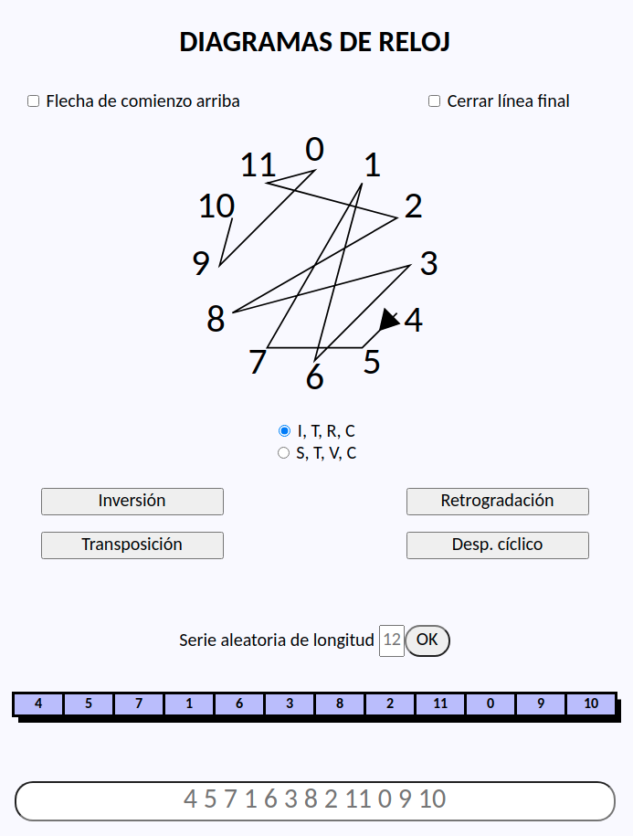

# Clock diagrams
Clock diagram visualizer for the twelve tone composition method.

Read my series of articles in the Spanish journal *Divulgamat*:
* [Serialismo y matemáticas I](http://www.divulgamat.net/divulgamat15/index.php?option=com_content&view=article&id=18209&directory=67)
* [Serialismo y matemáticas II](http://www.divulgamat.net/divulgamat15/index.php?option=com_content&view=article&id=18227&directory=67)
* [Serialismo y matemáticas III](http://www.divulgamat.net/divulgamat15/index.php?option=com_content&view=article&id=18258&directory=67)
* [Re-escalando música](http://www.divulgamat.net/divulgamat15/index.php?option=com_content&view=article&id=18273&directory=67)

